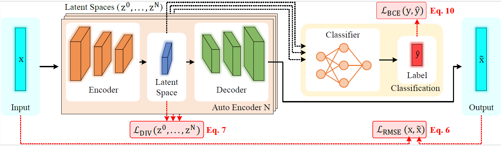

# Diversity-Enforced Latent Representations in AutoEncoder Ensembles for Cross-Dataset Network Intrusion Detection

&nbsp;&nbsp;&nbsp;&nbsp;Machine learning-based network intrusion detection systems (NIDS) achieve high detection accuracies in controlled experimental settings, yet their effectiveness degrades in real-world networks due to reliance on single-dataset training and evaluation, which fail to account for the variability and evolution of network traffic across heterogeneous environments. This over-estimation of generalization capabilities in current practices is a critical limitation. We propose a novel cross-dataset capable ML-based NIDS built upon an ensemble of AutoEncoders designed to extract diverse and discriminative latent feature representations. The model jointly optimizes reconstruction accuracy, latent space diversity, and classification performance through a multiobjective training framework, explicitly enforcing diversity at the feature level to reduce dependency on dataset-specific characteristics and improve robustness to distributional shifts. Extensive evaluations using four widely adopted intrusion detection datasets under both same-domain and cross-dataset settings reveal that traditional ML-based NIDSs suffer severe performance degradation across domains. Our approach consistently improves F1 scores across all four datasets, with gains of 0.14 on NF-BoT-IoT, 0.32 on NF-ToN-IoT, 0.05 on NF-UNSW-NB15, and 0.01 on NF-CICIDS2018 compared to an MLP baseline, establishing its effectiveness for reliable intrusion detection under diverse network conditions.

  

   

# In summary, the main objectives of this work are:

• To evaluate the generalization capability of traditional ML techniques in NIDS, assessing their performance across multiple domains, where experiments demonstrate their limited ability to generalize;

• Develop an ML model based on an ensemble of Deep AutoEncoders, designed to extract diverse features and improve generalization, thereby enabling deployment across heteroge neous network domains for NIDS;

• To compare the results obtained from training with varying architectural configurations of the Deep Autoencoder ensem- ble, using different datasets to pursue DA.

# Project Setup

1) Start by cloning the project (Install git: https://git-scm.com/download):

Shell: # git clone --depth=1 https://github.com/andreluizsp/NIDS-With-DA.git && cd NIDS-With-DA

$ ls

MLP_4_E10-26Features-FineTunning.ipynb
...

2) To open and run the notebook locally, it is recommended to use JupyterLab. After ensuring that Python and JupyterLab are installed, launch the environment from the project root directory using:

$ jupyter lab

Then, access the notebook MLP_4_E10-26Features-FineTunning.ipynb directly through the JupyterLab interface.

3) Alternatively, the notebook can be executed using Google Colab. In this case, upload the .ipynb file directly to Colab or open it by providing the GitHub repository URL via File → Open notebook → GitHub. This option is particularly useful for running experiments without local environment configuration and for leveraging cloud-based computational resources.

# Notebooks

  <b>MLP_4_E10-26Features-FineTunning.ipynb</b> 
  
    Jupyter Notebook: This notebook demonstrates a traditional Machine Learning model (using an MLP) 
  
  <b>1AE_MLP_4_512_E10_100_26Features_16LatentSpace-Cos3.ipynb</b> 
  
    Jupyter Notebook: This notebook demonstrates a proposed model using 1 AutoEncoder
    
  <b>2AE_MLP_4_512-512-E10-100_26Features_16LatentSpace-Cos3.ipynb</b> 
  
    Jupyter Notebook: This notebook demonstrates a proposed model using 2 AutoEncoder 
    
  <b>3AE_MLP_4_512-512-512-E10-100_26Features_16LatentSpace-Cos3.ipynb</b> 
  
    Jupyter Notebook: This notebook demonstrates a proposed model using 3 AutoEncoder 

  <b>4AE_MLP_4_512-512-512-512-E10-100_26Features_16LatentSpace-Cos3.ipynb</b> 
  
    Jupyter Notebook: This notebook demonstrates a proposed model using 4 AutoEncoder 
